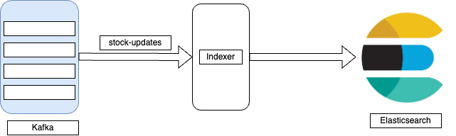

# Event driven indxer service

This application provides an indexing service by consuming stock data and indexing into elasticsearch. 




### Framework

[Spring Kafka Reference Document](https://docs.spring.io/spring-kafka/reference/html/)

Spring kafka is used to consume messages and elasticsearch high level
rest client to index documents.

### Kafka topics

- stock-updates

### Elastic search indices

- stock_updates_*

### Consumer group

- user-update-*

### Dependencies 

- Kafka
- Elasticsearch
- Kafdrop

### Python script Dependencies
- python 3.9
- kafka-python 2.0.2
- yfinance 0.2.41

## Instructions

### Tests
Run the tests using the command:

```
gradle test
```
>
> Note: The integration tests automatically starts and
> stops the docker test containers.

### Application

The dependencies mentioned above can be run in a docker environment. Firstly,
create and image of the application using:

```
docker build -t eventapi .
```

Next, run the application and dependencies using the command:
```
docker compose up -d
```
>
> Note: The docker compose file is set to download images for **arm** architecture. 
> For **linux/amd64** architecture, specify it in the "platform"
> field in the docker compose file.

Run the stockfeed script using the command:

```
python stockfeed.py
```

The stock data will be consumed by the application and indexed into elasticsearch in the index "stock_updates_*". An example
is shown below:

```
{
                    "timestamp": "2024-08-21 14:00:00-04:00",
                    "stocks": [
                        {
                            "company": "Apple Inc.",
                            "code": "AAPL",
                            "adjClose": 226.12,
                            "open": 226.17,
                            "close": 226.12,
                            "high": 226.42,
                            "low": 225.86,
                            "volume": 0
                        },
                        {
                            "company": "Alphabet Inc.",
                            "code": "GOOGL",
                            "adjClose": 165.93,
                            "open": 166.02,
                            "close": 165.93,
                            "high": 166.36,
                            "low": 165.83,
                            "volume": 0
                        },
                        {
                            "company": "Coca Cola",
                            "code": "KO",
                            "adjClose": 69.48,
                            "open": 69.48,
                            "close": 69.48,
                            "high": 69.505,
                            "low": 69.47,
                            "volume": 0
                        },
                        {
                            "company": "Microsoft Corporation",
                            "code": "MSFT",
                            "adjClose": 423.88,
                            "open": 423.97,
                            "close": 423.88,
                            "high": 424.545,
                            "low": 423.74,
                            "volume": 0
                        },
                        {
                            "company": "Pepsi Co.",
                            "code": "PEP",
                            "adjClose": 175.07,
                            "open": 175.11,
                            "close": 175.07,
                            "high": 175.18,
                            "low": 175.02,
                            "volume": 0
                        }
                    ]
                }
```


